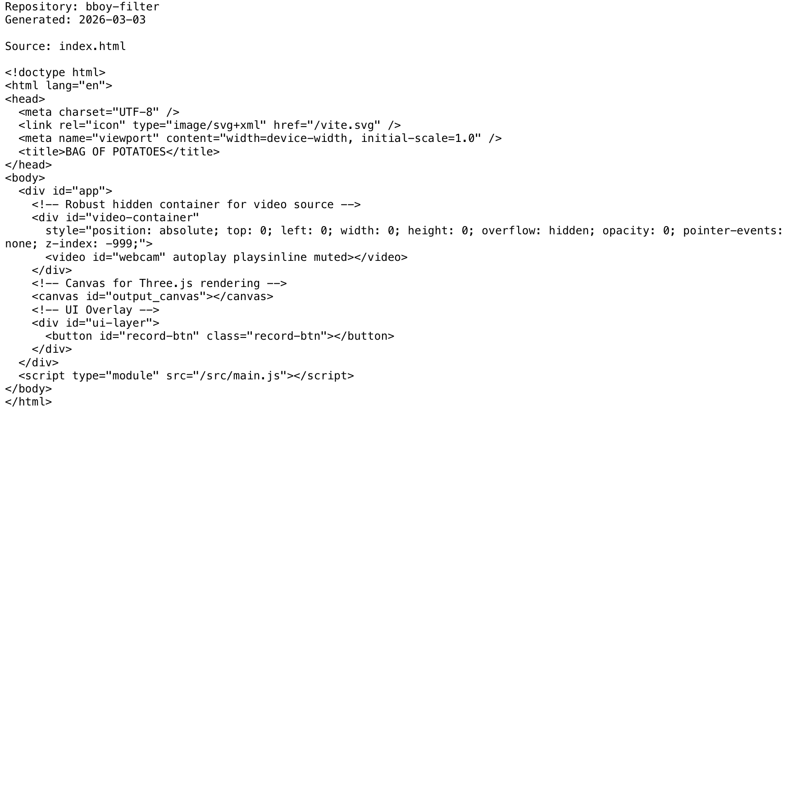

# Project Narrative & Proof

Generated: 2026-03-03

## User Journey
1. Discover the project value in the repository overview and launch instructions.
2. Run or open the build artifact for bboy-filter and interact with the primary experience.
3. Observe output/behavior through the documented flow and visual/code evidence below.
4. Reuse or extend the project by following the repository structure and stack notes.

## Design Methodology
- Iterative implementation with working increments preserved in Git history.
- Show-don't-tell documentation style: direct assets and source excerpts instead of abstract claims.
- Traceability from concept to implementation through concrete files and modules.

## Progress
- Latest commit: 4473767 (2026-03-02) - docs: add professional README with badges
- Total commits: 4
- Current status: repository has baseline narrative + proof documentation and CI doc validation.

## Tech Stack
- Detected stack: Node.js, GitHub Actions, JavaScript, HTML/CSS

## Main Key Concepts
- Key module area: `public`
- Key module area: `src`

## What I'm Bringing to the Table
- End-to-end ownership: from concept framing to implementation and quality gates.
- Engineering rigor: repeatable workflows, versioned progress, and implementation-first evidence.
- Product clarity: user-centered framing with explicit journey and value articulation.

## Show Don't Tell: Screenshots


## Show Don't Tell: Code Excerpt
Source: `index.html`

```html
<!doctype html>
<html lang="en">
<head>
  <meta charset="UTF-8" />
  <link rel="icon" type="image/svg+xml" href="/vite.svg" />
  <meta name="viewport" content="width=device-width, initial-scale=1.0" />
  <title>BAG OF POTATOES</title>
</head>
<body>
  <div id="app">
    <!-- Robust hidden container for video source -->
    <div id="video-container"
      style="position: absolute; top: 0; left: 0; width: 0; height: 0; overflow: hidden; opacity: 0; pointer-events: none; z-index: -999;">
      <video id="webcam" autoplay playsinline muted></video>
    </div>
    <!-- Canvas for Three.js rendering -->
    <canvas id="output_canvas"></canvas>
    <!-- UI Overlay -->
    <div id="ui-layer">
      <button id="record-btn" class="record-btn"></button>
    </div>
  </div>
  <script type="module" src="/src/main.js"></script>
</body>
</html>
```
